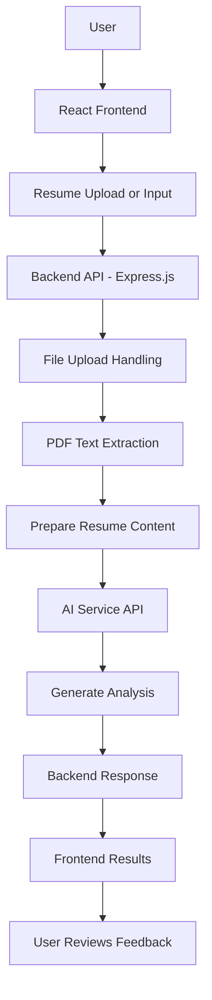

# 🚀 AI Resume Analyzer

An AI-powered web application designed to help job seekers analyze their resumes, identify areas for improvement, and receive AI-generated feedback.

**Built with:** React.js, Vite, Node.js, Express.js, and AI API integration.

## 🌐 Project Links

- **Live Application:** https://ai-resume-analyzer-one-amber.vercel.app/
- **GitHub Repository:** https://github.com/dikshikka03/ai-resume-analyzer
- **Developer:** [Dikshika](https://github.com/dikshikka03)

## 📌 Table of Contents

- [Overview](#-overview)
- [Problem Statement](#-problem-statement)
- [Key Features](#-key-features)
- [Technology Stack](#-technology-stack)
- [System Architecture](#-system-architecture)
- [Application Workflow](#-application-workflow)
- [Project Structure](#-project-structure)
- [Installation and Setup](#-installation-and-setup)
- [Environment Variables](#-environment-variables)
- [Deployment](#-deployment)
- [Security Considerations](#-security-considerations)
- [Future Enhancements](#-future-enhancements)
- [Author](#-author)

---

## 🎯 Overview

AI Resume Analyzer is a web-based application that combines document processing, backend API integration, and AI-powered analysis to simplify resume evaluation.

The application is designed to process resume content, analyze it using a configured AI service, and present feedback that can help users improve their resumes.

This project demonstrates practical implementation of full-stack development, API integration, document processing, environment configuration, and cloud deployment.

## ❓ Problem Statement

Job seekers often find it difficult to determine whether their resumes effectively communicate their skills and experience.

Manual resume reviews can be time-consuming and may overlook opportunities to improve the structure, clarity, and relevance of resume content.

AI Resume Analyzer aims to simplify this process by providing an accessible application that processes resume content and generates AI-assisted feedback.

## ✨ Key Features

- **Resume Analysis:** Submit resume content for AI-assisted evaluation.
- **Document Processing:** Handle uploaded resume documents using the configured processing pipeline.
- **AI Integration:** Connect the backend to a generative AI service.
- **Actionable Feedback:** Display generated analysis to help users identify potential improvements.
- **Web-Based Interface:** Interact with the application through a modern frontend.
- **Backend API:** Coordinate requests, document processing, and AI integration.
- **Cloud Deployment:** Make the application accessible through its deployed environment.

> Note: Confirm that each feature is implemented in the current source code before describing it as a working feature.

## 🛠️ Technology Stack

| Technology | Purpose |
|---|---|
| React.js | Frontend user interface |
| Vite | Frontend development and production builds |
| Tailwind CSS | UI styling, if configured |
| Node.js | Backend JavaScript runtime |
| Express.js | HTTP server and API routing |
| Multer | File upload handling, if implemented |
| pdf-parse | PDF text extraction, if implemented |
| Google Generative AI SDK | AI integration, if configured |
| dotenv | Environment variable configuration |
| Git and GitHub | Version control and source-code hosting |
| AWS | Cloud hosting, according to the deployed architecture |
| Vercel | Frontend hosting, if used for the current deployment |

## 🏗️ System Architecture

The application follows a frontend-backend architecture in which the frontend accepts user input, the backend coordinates document processing, and an AI service generates the analysis.



### Architecture Components

**1. Presentation Layer**

The frontend, built with React.js and Vite, provides the interface for users to submit resume input and view the resulting analysis.

**2. Backend API Layer**

The Node.js and Express.js backend receives requests, coordinates processing, communicates with the AI service, and returns responses to the frontend.

**3. Document Processing Layer**

The file-processing component handles supported uploads. PDF parsing extracts text from the uploaded document before the content is passed to the analysis workflow.

**4. AI Integration Layer**

The backend sends the prepared resume content to the configured AI service. The model generates feedback according to the application's prompt and processing logic.

**5. Response Layer**

The backend processes the AI response and returns the result to the frontend for presentation.

**6. Deployment Layer**

The application components are deployed using the configured hosting services. The frontend must communicate with the correct production backend endpoint.

## 🔄 Application Workflow

1. **User Input:** The user opens the application and provides a resume through the available input method.
2. **Request Submission:** The frontend sends the resume or associated content to the backend API.
3. **Upload Handling:** The backend receives and handles the submitted document.
4. **Text Extraction:** The document-processing component extracts readable text from supported PDF files.
5. **Input Preparation:** The extracted content is prepared for AI analysis.
6. **AI Processing:** The backend communicates with the configured AI service.
7. **Response Handling:** The backend receives and processes the generated result.
8. **Result Presentation:** The frontend displays the analysis to the user.

The exact workflow depends on the implemented routes, document formats, AI prompts, and response-handling logic.

## 📁 Project Structure

The following is a representative project structure. Update it to match the actual repository.

```text
ai-resume-analyzer/
├── public/
├── src/
│   ├── components/
│   ├── App.jsx
│   └── main.jsx
├── backend/
│   ├── server.js
│   └── routes/
├── package.json
├── package-lock.json
├── vite.config.js
├── .gitignore
├── .env.example
└── README.md
```

## ⚙️ Installation and Setup

### Prerequisites

- Node.js
- npm
- Git
- A valid API key for the configured AI provider

### 1. Clone the Repository

```bash
git clone https://github.com/dikshikka03/ai-resume-analyzer.git
cd ai-resume-analyzer
```

### 2. Install Dependencies

```bash
npm install
```

If the backend is maintained in a separate directory with its own `package.json`, install its dependencies separately:

```bash
cd backend
npm install
```

### 3. Configure Environment Variables

Create a `.env` file in the directory expected by the application.

Add the required environment variables using the names referenced in your source code.

### 4. Start the Backend

If the backend entry file is `server.js`, you can start it using:

```bash
node server.js
```

Alternatively, use the start script defined in the backend's `package.json`.

### 5. Start the Frontend

From the directory containing the frontend's `package.json`, run:

```bash
npm run dev
```

Open the local URL displayed in the terminal.

Make sure the frontend is configured to communicate with the backend running locally.

## 🔐 Environment Variables

Example configuration:

```env
GEMINI_API_KEY=your_api_key_here
PORT=5000
VITE_API_URL=http://localhost:5000
```

These are example variable names. Use the exact names expected by your application.

**Important security practices:**

- Never commit real API keys or credentials to GitHub.
- Keep `.env` files in `.gitignore`.
- Use `.env.example` to document required variables with placeholder values.
- Store production secrets in your hosting provider's environment configuration or secret manager.
- Never expose private AI provider credentials in frontend code.

## 🔌 API Workflow

The backend API coordinates communication between the frontend, document-processing logic, and the AI service.

```text
Frontend Request
       |
       v
Backend API Route
       |
       v
Input Validation
       |
       v
Resume Text Extraction
       |
       v
AI Service Request
       |
       v
Response Processing
       |
       v
Frontend Displays Results
```

Document the actual API endpoints implemented in the repository, including:

- Endpoint URL
- HTTP method
- Required request fields
- File upload requirements
- Response format
- Validation and error responses

## ☁️ Deployment

The application is available through its deployed frontend URL:

**Live Application:** https://ai-resume-analyzer-one-amber.vercel.app/

### Frontend Deployment

The frontend can be built for production using Vite:

```bash
npm run build
```

The production build is typically generated in the `dist/` directory.

Deploy the generated assets using the configured frontend hosting service.

### Backend Deployment

The backend must run in an environment that supports Node.js and has access to the required environment variables.

If AWS hosts the backend, document the specific AWS service used, its configuration, and the production API URL.

### Production Checklist

- [ ] Frontend uses the correct production backend URL.
- [ ] Backend environment variables are configured.
- [ ] AI provider credentials are valid.
- [ ] CORS is configured for the intended frontend origin.
- [ ] File types and upload sizes are validated.
- [ ] Errors are handled without exposing sensitive information.
- [ ] The complete resume-analysis workflow has been tested.

## 🛡️ Security Considerations

- **API Key Protection:** Store sensitive credentials in environment variables or a secret manager.
- **File Validation:** Validate file types and sizes on the backend.
- **Input Validation:** Treat uploaded document content as untrusted input.
- **API Security:** Apply appropriate request validation and rate limiting.
- **CORS:** Restrict cross-origin access to trusted frontend origins.
- **Privacy:** Avoid logging full resumes or unnecessary personal information.
- **Credential Rotation:** Rotate exposed credentials and address accidental exposure in repository history.

## 🚧 Future Enhancements

Potential improvements include:

- Job-description matching.
- Skill-gap identification.
- More detailed resume improvement reports.
- Support for additional document formats.
- Automated backend and frontend testing.
- Improved error handling and monitoring.
- Enhanced resume privacy controls.

These items are potential enhancements rather than claims about existing functionality.

## 👩‍💻 Author

**Dikshika**

B.Tech Computer Science and Engineering — Artificial Intelligence and Machine Learning

- **GitHub:** https://github.com/dikshikka03
- **Repository:** https://github.com/dikshikka03/ai-resume-analyzer
- **Live Project:** https://ai-resume-analyzer-one-amber.vercel.app/

## 📄 License

No license has been specified in this README. Add an appropriate license file if you intend to distribute the project for reuse.
