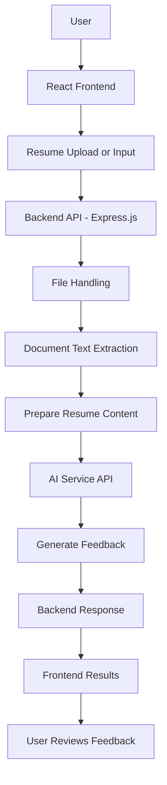

# 🚀 AI Resume Analyzer

An AI-powered web application that helps job seekers analyze their resumes, identify areas for improvement, and receive AI-generated feedback through a streamlined web interface.

**Built with:** React.js, Vite, Node.js, Express.js, and AI API integration.

<p align="center">
  <a href="https://ai-resume-analyzer-one-amber.vercel.app/">
    
  </a>
  <a href="https://github.com/dikshikka03/ai-resume-analyzer">
    
  </a>
</p>

---

## 📌 Table of Contents

- [Overview](#-overview)
- [Problem Statement](#-problem-statement)
- [Key Features](#-key-features)
- [Technology Stack](#-technology-stack)
- [System Architecture](#-system-architecture)
- [Application Workflow](#-application-workflow)
- [Project Structure](#-project-structure)
- [Installation and Setup](#-installation-and-setup)
- [Environment Variables](#-environment-variables)
- [Deployment](#-deployment)
- [Security Considerations](#-security-considerations)
- [Future Enhancements](#-future-enhancements)
- [License](#-license)
- [Contact](#-contact)

---

## 🎯 Overview

AI Resume Analyzer is a web-based application designed to simplify resume evaluation using document processing and AI-powered analysis.

The application accepts resume input, processes the available content, and uses a configured AI service to generate feedback that can help users identify opportunities to improve their resumes.

The project demonstrates the integration of frontend development, backend API development, document handling, external AI services, environment configuration, and application deployment.

### 🎯 Project Objectives

- Simplify the resume review process.
- Use AI to generate useful feedback from resume content.
- Build a functional full-stack web application.
- Integrate frontend and backend components through APIs.
- Deploy the application for remote access.
- Apply secure configuration practices for external services.

## ❓ Problem Statement

Job seekers may find it difficult to determine whether their resumes communicate their skills, experience, and qualifications effectively.

Manual resume reviews can be time-consuming, and candidates may struggle to identify areas that need improvement.

AI Resume Analyzer aims to make resume evaluation more accessible by combining document processing with AI-generated feedback in a web-based application.

## ✨ Key Features

- **Resume Analysis:** Submit resume content for AI-assisted evaluation.
- **Document Processing:** Process supported resume documents using the configured processing pipeline.
- **AI Integration:** Connect the backend to a generative AI service.
- **Feedback Generation:** Present AI-generated insights to help users review their resume content.
- **Interactive Interface:** Provide a user-friendly web interface.
- **Backend API:** Coordinate requests, document processing, and AI integration.
- **Deployment:** Make the application available through a hosted environment.

> Note: Keep this feature list aligned with the functionality actually implemented in the repository.

---

## 🛠️ Technology Stack

| Technology | Purpose |
|---|---|
| React.js | Frontend user interface |
| Vite | Frontend development and production builds |
| Tailwind CSS | Styling, if configured |
| Node.js | Backend JavaScript runtime |
| Express.js | Backend server and API routing |
| Multer | File upload handling, if implemented |
| pdf-parse | PDF text extraction, if implemented |
| Google Generative AI SDK | AI integration, if configured |
| dotenv | Environment variable management |
| Git | Version control |
| GitHub | Source-code hosting |
| AWS | Cloud deployment, according to the configured architecture |
| Vercel | Frontend hosting, if used in the current deployment |

---

## 🏗️ System Architecture

The application uses a frontend-backend architecture in which the frontend collects user input, the backend coordinates processing, and the configured AI service generates analysis.



### Architecture Components

#### 1. Presentation Layer

**Technologies:** React.js and Vite

The frontend provides the interface for submitting resume input and displaying the analysis returned by the backend.

#### 2. Backend API Layer

**Technologies:** Node.js and Express.js

The backend receives requests, coordinates input processing, communicates with the AI service, and returns the generated response.

#### 3. Document Processing Layer

**Technologies:** Multer and PDF parsing, if configured

The upload-processing component handles supported documents. The PDF parser extracts readable text when PDF processing is implemented.

#### 4. AI Integration Layer

**Technology:** Configured generative AI provider

The backend prepares the resume content and submits it to the configured AI service. The generated response depends on the model, prompt, and processing logic used by the application.

#### 5. Response Layer

The backend handles the AI response and sends the result to the frontend for presentation.

#### 6. Deployment Layer

The application components run in their configured hosting environments. The frontend must use the correct backend endpoint, and production credentials must be configured securely.

---

## 🔄 Application Workflow

The typical resume-analysis workflow consists of the following stages:

1. **User Input:** The user opens the application and submits resume input.
2. **Frontend Request:** The frontend sends the input to the backend API.
3. **Request Handling:** The backend receives the request and performs the required validation.
4. **Document Processing:** If a document is uploaded, the configured parser extracts its text.
5. **Input Preparation:** The extracted text is prepared for the AI request.
6. **AI Analysis:** The backend communicates with the configured AI service.
7. **Response Processing:** The backend receives and processes the generated output.
8. **Result Display:** The frontend displays the returned feedback.

The precise stages depend on the implementation in the current source code.

---

## 📁 Project Structure

The following is a representative structure. Update it to match your actual repository files and directories.

```text
ai-resume-analyzer/
├── public/
├── src/
│   ├── components/
│   ├── App.jsx
│   └── main.jsx
├── backend/
│   ├── server.js
│   └── routes/
├── package.json
├── package-lock.json
├── vite.config.js
├── .gitignore
├── .env.example
└── README.md
```

---

## ⚙️ Installation and Setup

### Prerequisites

Before running the project locally, ensure you have:

- Node.js installed
- npm installed
- Git installed
- A valid API key for the configured AI provider

### Step 1: Clone the Repository

```bash
git clone https://github.com/dikshikka03/ai-resume-analyzer.git
cd ai-resume-analyzer
```

### Step 2: Install Dependencies

```bash
npm install
```

If the backend has a separate `package.json`, install its dependencies from the backend directory:

```bash
cd backend
npm install
```

### Step 3: Configure Environment Variables

Create a `.env` file in the directory expected by the application.

Add the variables required by the project, using the names defined in the source code.

### Step 4: Start the Backend

If the backend entry point is `server.js`, run:

```bash
node server.js
```

Alternatively, use the start command defined in the backend's `package.json`.

### Step 5: Start the Frontend

From the frontend project directory, run:

```bash
npm run dev
```

Open the local URL displayed in your terminal.

Ensure the frontend is configured to communicate with the locally running backend.

---

## 🔐 Environment Variables

Example configuration:

```env
GEMINI_API_KEY=your_api_key_here
PORT=5000
VITE_API_URL=http://localhost:5000
```

These are illustrative variable names. Replace them with the exact variables required by your implementation.

### Security Best Practices

- Never commit actual API keys or credentials.
- Add `.env` files to `.gitignore`.
- Provide placeholder values in `.env.example`.
- Configure production secrets through the hosting provider or a secret manager.
- Keep private API credentials on the backend rather than exposing them in frontend code.

---

## 🔌 API Workflow

The backend API coordinates requests between the frontend, document-processing logic, and AI service.

```text
Frontend Request
       |
       v
Backend API Route
       |
       v
Input Validation
       |
       v
Document Processing
       |
       v
AI Service Request
       |
       v
Response Processing
       |
       v
Frontend Displays Results
```

### API Documentation

Document the actual endpoints available in the repository, including:

- Endpoint path
- HTTP method
- Required request fields
- Accepted file types
- Response format
- Error responses

Only list API routes that are implemented and available in the current application.

---

## ☁️ Deployment

### Live Application

**Frontend URL:**  
https://ai-resume-analyzer-one-amber.vercel.app/

### Frontend Deployment

The frontend can be built for production using Vite:

```bash
npm run build
```

The production build is typically generated in the `dist/` directory.

Deploy the generated assets using the frontend hosting service configured for the project.

### Backend Deployment

The backend requires a suitable Node.js runtime and access to the required environment variables.

If AWS hosts the backend, document the actual AWS service used, its deployment configuration, and the production API endpoint.

### Production Checklist

- [ ] Frontend uses the correct production API URL.
- [ ] Required environment variables are configured.
- [ ] AI provider credentials are valid.
- [ ] CORS is configured for the intended frontend origin.
- [ ] File uploads are validated.
- [ ] Errors are handled without exposing sensitive information.
- [ ] The application has been tested end to end.

---

## 🛡️ Security Considerations

Because resume documents can contain personal information, security and privacy should be considered throughout the application.

- **Credential Protection:** Store API keys in environment variables or a secret manager.
- **File Validation:** Validate uploaded file types and sizes on the backend.
- **Input Validation:** Treat uploaded document content as untrusted input.
- **API Security:** Apply appropriate request validation and rate limiting.
- **CORS Configuration:** Restrict cross-origin access to trusted frontend origins.
- **Data Privacy:** Avoid logging complete resumes or unnecessary personal information.
- **Error Handling:** Avoid exposing internal implementation details in public error messages.
- **Credential Rotation:** Rotate exposed credentials and address accidental disclosure in repository history.

---

## 🚧 Future Enhancements

Potential areas for further development include:

- Job-description matching and relevance analysis.
- Skill-gap identification.
- More detailed resume improvement recommendations.
- Support for additional document formats.
- Automated tests for frontend and backend components.
- Improved error handling and monitoring.
- Enhanced resume privacy and data-management controls.

These are potential improvements, not claims about functionality already implemented.

---

## 📄 License

This project is licensed under the **MIT License**.

See the [LICENSE](LICENSE) file for the complete license text.

---

## 👩‍💻 Author

**Dikshika**

B.Tech in Computer Science and Engineering  
Specialization: Artificial Intelligence and Machine Learning

- **GitHub:** https://github.com/dikshikka03
- **Project Repository:** https://github.com/dikshikka03/ai-resume-analyzer
- **Live Application:** https://ai-resume-analyzer-one-amber.vercel.app/
- **Email:** YOUR_EMAIL_ADDRESS_HERE

Feel free to connect for discussions about AI, full-stack development, and software engineering projects.
